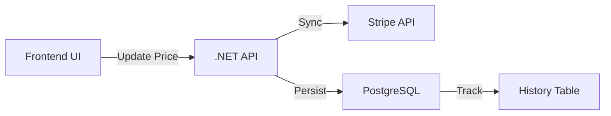

# Talent Pricing Management System

## Overview
This project implements a robust full-stack solution for managing talent pricing (Personal & Business) with seamless **Stripe Integration**. It is designed to be scalable, maintainable, and easy to audit.

### Key Features
- **Dynamic Pricing**: Separate Personal and Business pricing tiers.
- **Stripe Synchronization**: Automatic creation and updating of Stripe Products and Prices with thread-safe client management.
- **Atomic Operations**: Composite PostgreSQL functions ensure that DB updates and history logging happen in a single transaction.
- **Idempotency & Safety**: Prevents duplicate Stripe products and verifies talent existence before external calls.
- **Robust Update Flow**: Reordered operations (Create -> Update DB -> Archive) to ensure business continuity if cleanup tasks fail.
- **Audit Logging**: Full immutable history tracking of all price changes (`pricing_history`).
- **Modern UI**: Responsive Vue 3 frontend with transitions, real-time history display, and "Last Synced" info.

> [!NOTE]
> **New to the project?** Check out our [Project Walkthrough](file:///C:/Users/krist/.gemini/antigravity/brain/e08f5421-b696-4a49-8b57-8161da53083e/walkthrough.md) for a deep dive into the architecture, a beginner's glossary, and visual diagrams.


---

## 🏗 Architecture

The solution follows **Clean Architecture** principles to ensure separation of concerns:

### Backend (.NET 8)
- **Pattern**: CQRS with MediatR.
- **Data Access**: Dapper with snake_case mapping enabled.
- **Database**: PostgreSQL with logic encapsulated in Stored Functions (5 migrations included).
- **Security**: CORS policy configured and environment-safe Options Pattern for configuration.
- **Resilience**: Polly retry policies for Stripe API interactions.

### Frontend (Vue 3)
- **Framework**: Vue 3 (Composition API) + TypeScript.
- **Styling**: TailwindCSS + DaisyUI.
- **State**: Composable-based state management (`useTalentPricing`).

### 📊 Data Flow Diagram




---

## 🚀 Getting Started

### Prerequisites
- Docker & Docker Compose
- .NET 8 SDK (optional, for local dev)
- Node.js 18+ (optional, for local dev)

### Quick Start (Docker)
The easiest way to run the entire stack is via Docker Compose:

```bash
docker-compose up --build
```

The application will be available at:
- **Frontend**: http://localhost:3000
- **Backend API**: http://localhost:5000/swagger

### Manual Setup

#### 1. Configuration
Copy `backend/src/appsettings.Example.json` to `backend/src/appsettings.json` and fill in your Stripe Secret Key and Connection String.

#### 2. Database
Run all migrations in order from `database/migrations/*.sql`. The system now includes 5 critical migrations.

#### 3. Frontend
Create a `.env` file in `frontend/` if you need to point to a custom API URL:
`VITE_API_URL=http://localhost:5000/api`
```bash
cd frontend
npm install
npm run dev
```

---

## 🧪 Testing

### Unit Tests
A unit test project is included to verify core business logic and command handlers.
```bash
dotnet test backend/tests/TalentPricing.UnitTests
```

### API Testing
A Postman collection is provided in the `api/` folder for end-to-end API testing.

---

## 📝 Design Decisions & Assumptions

1.  **Database Logic**: Core data modification logic is placed in PostgreSQL functions (`fn_upsert...`) to ensure data consistency and allow for potential usage by other services without duplicating logic.
2.  **Stripe Sync**: We treat Stripe as a downstream dependency. If Stripe fails, the transaction is rolled back (logical consistency).
3.  **Audit Log**: The `pricing_history` table is immutable and indexed for fast retrieval of historical data.
4.  **Validation**: Validation exists on both Frontend (UX) and Backend (Domain Integrity).

---

## Contact
**Candidate**: Kristijan Galić