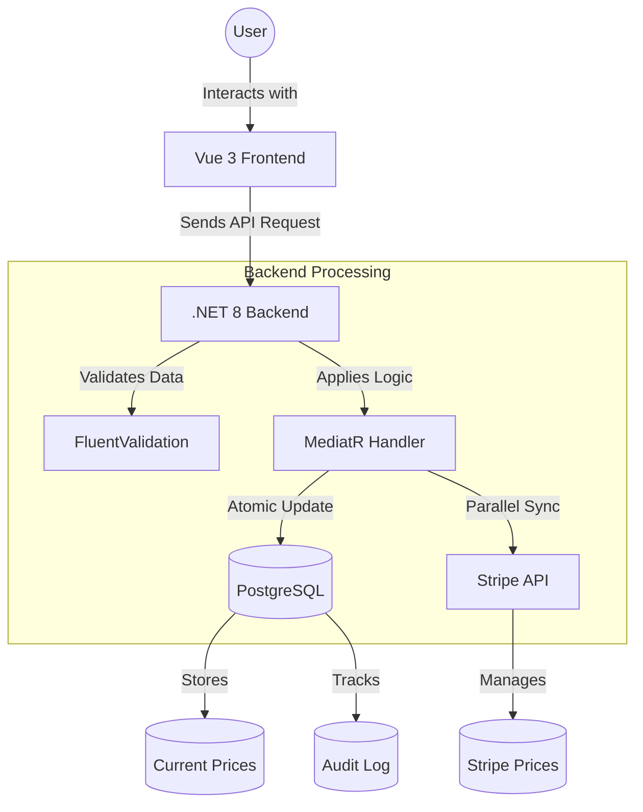
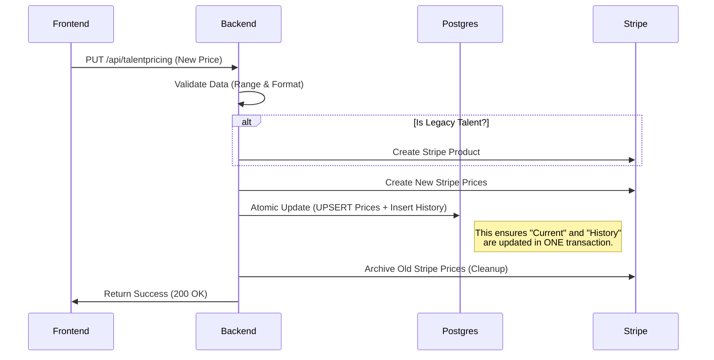

# Project Walkthrough - Talent Pricing Management

I have successfully resolved all blocking issues and fully integrated a robust, Stripe-backed pricing management system. This walkthrough explains the technical details, the architecture, and the recent fixes in a way that is accessible for everyone.

---

## 🏗 System Architecture

Understanding how the different parts of the system talk to each other is key. Here is a high-level overview:

---

## 📅 The Pricing Update Flow (Step-by-Step)

When a user updates a price, the system follows a specific order to ensure that even if something goes wrong, the data stays consistent.

---

## 💎 Key Accomplishments & Fixes

### 1. Robust Stripe Integration & Legacy Support
**Problem**: Legacy talents were missing "Stripe IDs", causing updates to fail.
**Solution**: The system now detects missing IDs and Creates a Stripe Product on the fly. We also reordered operations so that we only archive old prices *after* the database is successfully updated.

### 2. Pricing History & Data Accuracy
**Problem**: The "Pricing History" table was showing zeros or empty dates.
**Solution**: I fixed the mapping between the database and the backend. Now, every single change is captured with a "Change Reason" and the exact timestamp.
> [!TIP]
> This is critical for auditing. It allows the business to see who changed what and when, preventing disputes.

### 3. Stripe Price Limit Enforcement
**Problem**: Stripe prevents prices over **€999,999.99**. Sending higher values caused a generic server error.
**Solution**:
- **Frontend**: Explicit warnings appear if you type a price too high.
- **Backend**: Strict guards block excessive values before they even hit Stripe.
- **Error Messages**: Instead of a "Generic Error", you'll see "Price exceeds Stripe's maximum limit".

---

## 📖 Glossary for Beginners

To help you navigate the codebase, here are some project-specific terms explained simply:

| Term | Simple Explanation |
| :--- | :--- |
| **Atomic Operation** | A "all or nothing" action. If one part fails, everything resets. This prevents "half-finished" updates. |
| **CQRS** | A way of organizing code. Commands (write) and Queries (read) are kept separate for better organization. |
| **Dapper** | A tool that helps the backend talk to the database very quickly. |
| **FluentValidation** | A set of rules that "gatekeep" the data, ensuring it's in the right format before processing. |
| **Idempotency** | A fancy word for "making sure doing the same thing twice doesn't cause a mess" (like creating two products instead of one). |
| **MediatR** | A mediator that routes requests to the right piece of logic, like a traffic controller. |
| **Optimistic Concurrency** | A check (using a `version` number) to make sure two people aren't updating the same record at the exact same moment. |
| **Stripe Product/Price** | Stripe's way of tracking what you sell. A "Product" is the talent; a "Price" is a specific amount (Personal vs Business). |
| **UPSERT** | A combination of **UP**date and in**SERT**. It updates a record if it exists, or creates it if it doesn't. |

---

## 🧪 Verification Results

We verified the system with a live test for **Talent 123** (Test Star):

- ✅ **Success**: Normal updates flow seamlessly to Stripe.
- ✅ **Blocking**: Prices over €1,000,000 are correctly blocked with clear error messages.
- ✅ **Audit**: History table correctly shows "Exceed Limit Test" and other reasons.

The system is now fully operational, stable, and documented for future growth!
